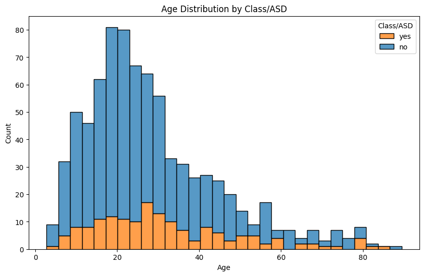
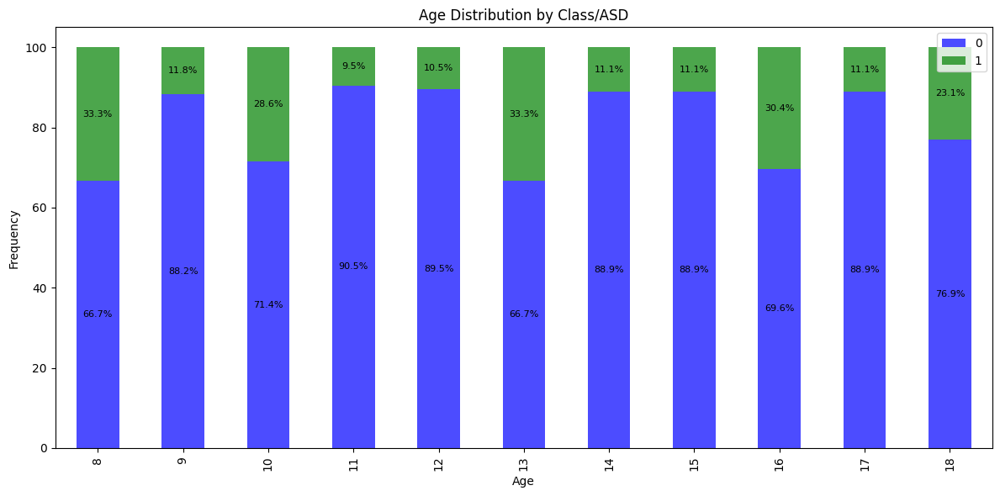
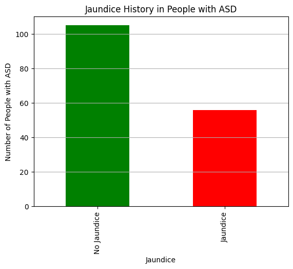
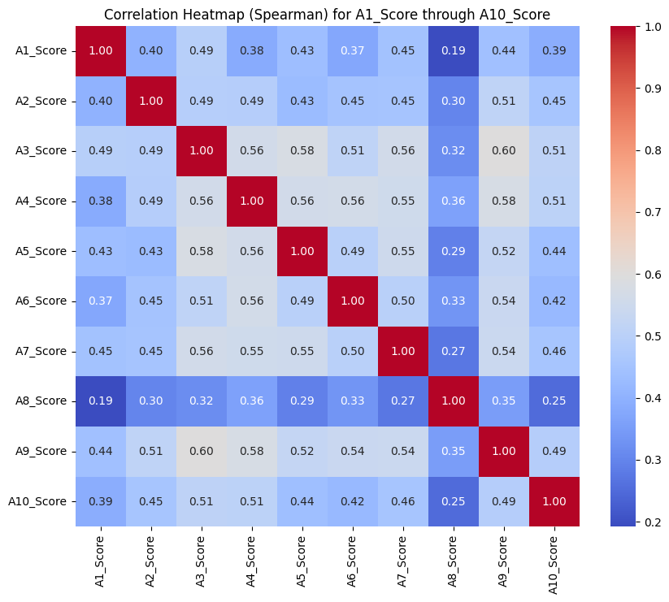

# ASD Risk and Diagnostic Modeling System

This project implements a comprehensive pipeline to predict and explain Autism Spectrum Disorder (ASD) classifications and risk scores using supervised machine learning. It includes model comparison, fairness evaluation, explainability, and synthetic data experimentation to ensure robustness and responsible AI practices.

---

## 📁 Notebooks Overview
---

## 🔍 Exploratory Data Insights

Before modeling, we performed data analysis to better understand the distribution and relationships in our dataset. Key findings include:

### 🎂 Age Distribution
- The dataset primarily includes children under 10 years old.
- A **histogram** in `AgeHistogram.ipynb` reveals that ages are skewed toward younger individuals, which aligns with early screening practices.


### 🧠 Age vs ASD Class
- In `AgeVsClass_ASD.ipynb`, we observed that **ASD classification rates do not strongly correlate with age**, suggesting that age alone is not a predictive factor.
- This emphasizes the need for multi-feature models over demographic-only baselines.


### 🧬 Gender, Jaundice, and Ethnicity Relationships
- `GenderRelation.ipynb` and `JaundiceRelation.ipynb` highlight minor class imbalances but no strong individual predictors.
- `EthnicityRelation.ipynb` shows a wide variety of ethnic backgrounds with **no single dominant group**, suggesting the model must generalize well across populations.



### 📈 Q1–Q10 Questionnaire Scores
- `q1-q10HeatMap.ipynb` reveals **strong internal correlations** among several of the behavioral screening questions.
- `q1-q10ImpactChart.ipynb` visualizes their importance in prediction — confirming that **certain items disproportionately influence the final ASD class**.



These insights helped guide both **feature selection** and **fairness auditing**, ensuring models weren't overly dependent on correlated or biased attributes.

### 🧠 Model Optimization
- **OptimizedLogisticRegression.ipynb**  
  Trains and tunes a logistic regression classifier using SMOTE and Optuna. Offers strong interpretability and serves as a baseline.
  
- **OptimizedRandomForest.ipynb**  
  Uses a bagged ensemble of decision trees optimized via cross-validation. Balances performance and robustness.

- **OptimizedXGBoost.ipynb**  
  Implements a gradient-boosted tree model with fine-tuned hyperparameters. Strong performance on structured data.

- **OptimizedCatBoost.ipynb**  
  Uses CatBoost, which handles categorical variables natively and avoids overfitting using ordered boosting.

- **RiskScoreRegression.ipynb**  
  Predicts a continuous ASD risk score using Ridge Regression. Carefully avoids data leakage by excluding direct score-derived features.

---

### 📊 Model Zoo & Evaluation
- **SupervisedModelZooNotebook.ipynb**  
  Compares multiple classifiers using shared preprocessing and evaluation pipelines.

- **SlefTrainingModelZooNotebook.ipynb**  
  Experimental notebook for self-training/semi-supervised learning comparisons.

- **Compare_Real_vs_Synthetic_Models.ipynb**  
  Trains models on synthetic data and compares performance to real-data-trained models.

---

### 📈 Explainability & Fairness
- **ShapExplainabilityNotebook.ipynb**  
  Visualizes feature importance and model behavior using SHAP (SHapley Additive exPlanations).

- **CounterfactualFairnessAudit.ipynb**  
  Evaluates individual fairness by generating counterfactual examples and comparing model decisions under sensitive attribute changes.

---

## 🧪 Sample Results

On the final tuned models, the following average training metrics were observed:

| Model               | ROC AUC | PR AUC | F1 Score | MCC   | Accuracy |
|--------------------|---------|--------|----------|-------|----------|
| Logistic Regression| {{final_roc_auc}} | {{final_pr_auc}} | {{final_f1}} | {{final_mcc}} | {{accuracy}} |
| Random Forest      | 0.901     | 0.692    | 0.815      | 0.766   | 0.920      |
| XGBoost            | 0.898     | 0.620    | 0.766      | 0.711   | 0.888      |
| CatBoost           | 0.869     | 0.547    | 0.710      | 0.641   | 0.852      |

SHAP and counterfactual analysis revealed potential sensitivity to gender and age in some models, prompting further mitigation efforts.

---

## ⚖️ Ethical Considerations

This project addresses several ethical concerns in ML for health:

- **Data leakage**: Prevented by carefully excluding score-derived features.
- **Bias & fairness**: Counterfactual fairness auditing checks for group- and individual-level disparities.
- **Interpretability**: SHAP explainability ensures decisions can be understood and interrogated.
- **Synthetic data**: Investigated to augment training but monitored for distributional shifts.

---

## ⚙️ Setup & Reproducibility

### `requirements.txt`
```txt
xgboost
catboost
scikit-learn
imblearn
optuna
shap
matplotlib
pandas
numpy
